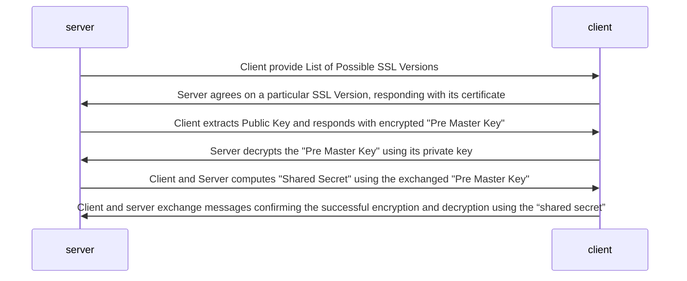
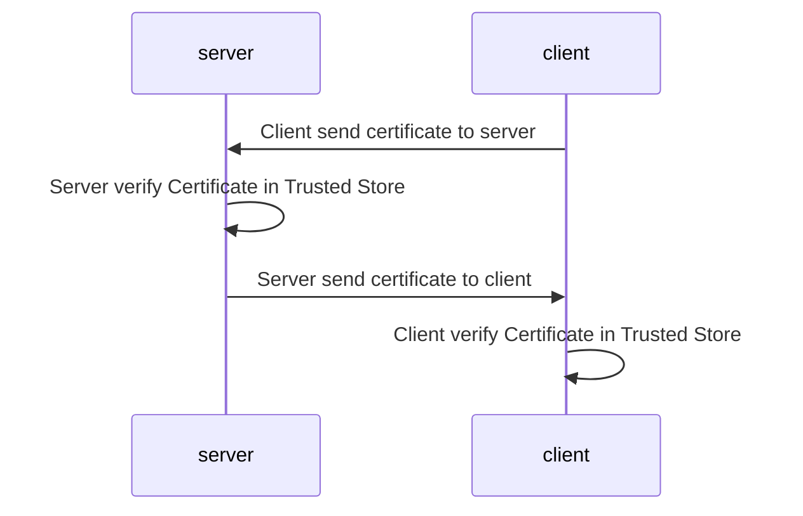

# SSL Configuration


- **SSL**: Secure Sockets Layer
- **TLS**: Transport Layer Security

## Useful Links
- [Securing Spring Boot App with SSL Blog](https://spring.io/blog/2023/06/07/securing-spring-boot-applications-with-ssl)
- [Securing Spring Boot 3 Applications With SSL Bundles](https://www.baeldung.com/spring-boot-security-ssl-bundles)
- [Spring Boot Docs](https://docs.spring.io/spring-boot/reference/io/rest-client.html)

## What is an SSL certificate?
- An SSL certificate is like an ID card or a badge that proves someone is who they say they are. [learn more .. ](https://www.cloudflare.com/learning/ssl/what-is-ssl/)

### Types of SSL Certificates
- Single-domain: A single-domain SSL certificate applies to only one domain (a "domain" is the name of a website, like www.cloudflare.com).
- Wildcard: Like a single-domain certificate, a wildcard SSL certificate applies to only one domain. However, it also includes that domain's subdomains. For example, a wildcard certificate could cover www.cloudflare.com, blog.cloudflare.com, and developers.cloudflare.com, while a single-domain certificate could only cover the first.
- Multi-domain: As the name indicates, multi-domain SSL certificates can apply to multiple unrelated domains.

### Handshake Flow



In order to perform this communication successfully certificates shared between the server and client must be trusted and 
they are 2 ways to of verifications:

1. One-Way SSL
2. Two-Way SSL

#### One Way SSL
In One-Way SSL when server agrees with SSL version and send `public-key` to client, this one
must have this public key as a trusted certificate, otherwise connection will be refused. This 
technique `leave server to trust all clients`.

#### Two Way SSL
On the other hand, when talking about Two-Way SSL, client and server must present and accept each other certificates.



### SSL Spring Boot Configuration
To configure SSL in Spring Boot, there is an easy option since V3.1 using bundles through application.[properties|yml]

In order to activate bundles you will need to follow the below steps:
1. Specify the server name of the ssl-bundle you will be using:

```properties
server.ssl.bundle = bundle-name
```
2. Specify key, store. 

```properties
# Store will work as Trusted Store for Server to verify trusted certificates. This can 
# can work for self-signed certificate by putting the public key of them within the store.

spring.ssl.bundle.jks.bundle-name.key.alias = keypair-alias
spring.ssl.bundle.jks.bundle-name.key.password = keypair-password
spring.ssl.bundle.jks.bundle-name.keystore.location = keypair-path
spring.ssl.bundle.jks.bundle-name.keystore.password = keystore-password
spring.ssl.bundle.jks.bundle-name.keystore.type = PKCS12
spring.ssl.bundle.jks.bundle-name.truststore.location = truststore-password
spring.ssl.bundle.jks.bundle-name.truststore.password = truststore-password
```
Above truststore file will contain all public from servers that you would like to trust

Example: If you have another service that contains self-signed certificate you might
want to include its public key inside the truststore. That way when server send the
certificate that one will be a valid one. Same happens if you want to use
rest client to test your endpoints since rest-client


### Self Signed Certificate Management

#### Creating Certificate
Below command line will be used to generate a key pair for ssl using keytool with comes
with JDK.

```bash
#FORMAT: keytool -genkeypair -alias `ALIAS_FOR_CERTIFICATE` -keyalg `KEY_ALGORITHM_DEFAULT_RSA` -keysize `KEY_SIZE_DEFAUL_2048` -storetype `PKCS12` -keystore `LOCATION_WHERE_KEYPAIR_WILL_BE_LOCATED`
#EXAMPLE:
keytool -genkeypair -alias pricing-ssl -keyalg RSA -keysize 2048 -storetype PKCS12 -keystore pricing-ssl.p12
```

#### Extracting Public Certificate
Once you have a keypair created you can always extract the public key by using below command
```bash
#FORMAT: keytool -exportcert -keystore `KEYPAIR_FILE` -storepass `KEYPAIR_FILE_PASSWORD` -storetype PKCS12 -alias `PUBLICKEY_ALIAS` -file `FILE_WHERE_CER_WILL_BE_SAVED`
#EXAMPLE:
keytool -exportcert -keystore pricing-ssl.p12 -storepass password -storetype PKCS12 -alias pricing-ssl -file pricing-ssl-pub.cer
```

If you want to import public key to a trust store you can use below command which 
create the store for you if it does not exist
```bash
#FORMAT: keytool -import -noprompt -trustcacerts -alias ALIASNAME -file FILENAME_OF_THE_INSTALLED_CERTIFICATE -keystore PATH_TO_CACERTS_FILE -storepass PASSWORD
#EXAMPLE:
keytool -import -noprompt -trustcacerts -alias pricing-ssl -file .\pricing-ssl-pub.cer -keystore pricing-store.p12 -storepass password
```

With Above configuration you should be able to start your application and use HTTPS. 

### Redirections
There will be sometimes that you will need to redirect all http calls to https calls. 
To achieve this you will need to create a configuration file within you project where you will 
need to add below configuration

```java
@Configuration
public class TomcatHTTPSConfig {

    private final static String CONNECTOR_PROTOCOL = "org.apache.coyote.http11.Http11NioProtocol";

    @Bean
    public WebServerFactoryCustomizer<TomcatServletWebServerFactory> containerCustomizer() {

        return factory -> {

            var httpConnector = createHttpConnector();

            factory.getAdditionalTomcatConnectors().add(httpConnector);
            factory.getTomcatContextCustomizers().add(context -> {

                SecurityConstraint securityConstraint = new SecurityConstraint();
                securityConstraint.setUserConstraint("CONFIDENTIAL");
                SecurityCollection collection = new SecurityCollection();
                collection.addPattern("/*");
                securityConstraint.addCollection(collection);

                context.addConstraint(securityConstraint);
            });
        };
    }

    private Connector createHttpConnector() {
        Connector connector = new Connector(CONNECTOR_PROTOCOL);
        connector.setScheme("http");
        connector.setSecure(false);
        connector.setPort(10004);
        connector.setRedirectPort(10005);
        return connector;
    }
}
```

### Anil Notes
[Sprig Security Project Example](https://github.com/H033S/spring-boot-expeditors-training-anil-notes/tree/master/code/SBF/SpringSecurity/src/main)
```
To configure the server to use SSL:
- Make a self signed certificate.  Important - the CN field
  where it asks you for first and last name, should be set to
  the hostname, e.g. localhost.
  
  keytool -genkeypair -alias larkuspring -keyalg RSA -keysize 2048 -storetype PKCS12
      -keystore larkUKeyfile.p12

- Make sure you point to this file with the appropriate properties in
  application.[properties|yml]
  Look at application-ssl.properties

To configure RestClient to use SSL
- Two ways to make it happen:
  - Set up the Client to use your self signed certificate created above.
    More info below.
  - Or, add your certificate the the official jdk certificates on your machine
    (the cacerts file).  Also more info below.

- Configure the client to use a certificate:  Look in SSLConfig.java
  - I still haven't found a clean way to set up just the RestClient to use SSL directly.
    Doing it right now through the RestTemplate.
    - Even with the RestTemplate, allegedly it should work through SSL bundles, but not
      happening for me yet.
    - So we are using pretty boiler plate code to set up the RestTemplate, and then
      creating the RestClient from that.


- The other way to use your self signed certificate is to
  add the public key from your certificate to the trusted certificates on
  of your jdk.  Then you don't need to do any special configuration of the RestClient.
  And an interesting side effect is that the SSLBundle configuration in SSLConfig starts to work.

  - To get this working you have to do first extract your public key from your new certificate:
    Here we are exporting the public key to a file called 'larkUPublicKey.cer'.

    keytool -exportcert -keystore larkUKeyfile.p12 -storepass password -storetype PKCS12
                                -alias larkuspring -file larkUPublicKey.cer

  - Then you have to input the .cer file into the cacerts file of your jdk
    - cd to path_to_your_jdk/lib/security.
    - You should see a file called 'cacerts' there.
    - MAKE A BACKUP of that file, e.g. cp cacerts cacerts.bak
    - import the cer file into cacerts.  The default password for cacerts
      is 'changeit'.

    keytool -importcert -keystore ./cacerts -storepass changeit -alias larkuspring
          -file path_to_your_project/src/main/resources/larkUPublicKey.cer

    Or, even better, use -cacerts to specify the cacerts directory from any where.
    For e.g., from the resource directory of the project:
    keytool -importcert -cacerts -storepass changeit -alias larkuspring -file ./larkUPublicKey.cer

    Restart your server and you should be able to hit it with a simple RestClient
    and an https url, e.g. https://localhost:8443/adminrest/student

   - To remove your certificate from the cacerts file:
     (The -cacerts option can be used to refer to the cacerts file.  Works from
      any directory)
     keytool -delete -alias larkuspring -cacerts -storepass changeit -v

Miscellaneous:
- To see the private key of a .p12 file:
openssl pkcs12 -in larkUKeyfile.p12 -nocerts

- To see the public keys of a .p12 file:
openssl pkcs12 -in larkUKeyfile.p12 -nokeys
```

### VM Option to see SSL communication
Activate SSL Debug Mode On: -Djavax.net.debug=ssl:handshake
